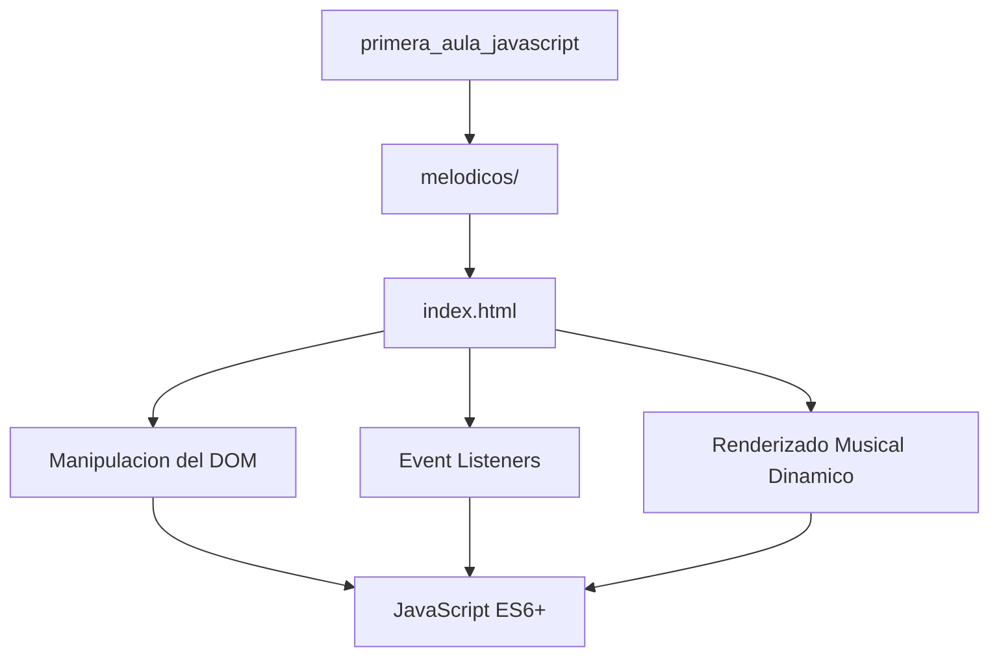

# JavaScript — Melodicos

> Primera práctica de JavaScript: aplicación interactiva web de contenido musical — Melodicos.

## Descripción

---

Primera práctica de programación web con **JavaScript** en el aula: desarrollo de la aplicación **Melodicos**, una experiencia web interactiva de contenido musical. Aplica los fundamentos de JavaScript ES6+ para la manipulación del DOM, manejo de eventos y renderizado dinámico de contenido musical en el navegador.

## Tecnologías utilizadas

| Tecnología | Uso |
|---|---|
| JavaScript ES6+ | Lógica de interactividad y manipulación del DOM |
| HTML5 | Estructura semántica y elementos multimedia |
| CSS3 | Diseño visual y animaciones |

## Arquitectura

## Conceptos JavaScript aplicados

- Selección y manipulación del DOM
- Event listeners y manejo de eventos de usuario
- Funciones de alto orden y callbacks
- Manipulación de arrays y objetos ES6

## Contexto académico

**Asignatura:** Desarrollo Web · **Institución:** Ingeniería Informática
**Autor:** Alejandro De Mendoza — Ingeniero Informático · Especialista Ingeniería de Software

---

## Autor

**Alejandro De Mendoza**  
Ingeniero Informático · Especialista en IA · Especialista en Ingeniería de Software · Máster en Arquitectura de Software

